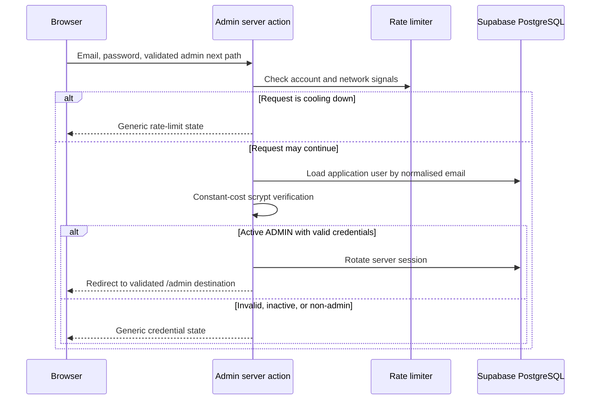

# Administrator authentication flow

## Scope

The administrator sign-in route is `/admin/login`. It has a dedicated authentication shell and does not initialise the storefront header, cart, wishlist, catalogue, product imagery, or customer registration experience.

## Authentication provider

Administrator credentials are validated by the Next.js server against the application `User` record stored in the Supabase-hosted PostgreSQL database through Prisma. Passwords are stored as salted scrypt hashes. The browser never receives the password hash, database connection string, Supabase service-role key, or a user-controlled role decision.

Supabase Auth is used by supported customer account flows, but administrator console access is currently authorised by the application user, role, status, and server session records.

## Sign-in sequence

The credential result is returned through server-action form state. Invalid credentials are not written to the public URL, and the entered password is never returned to the browser.

## Server-side authorisation

- The protected admin route-group layout calls `requireAdmin()`.
- Every existing mutating admin server action independently calls `requireAdmin()`.
- Admin API routes use `requireAdminApi()`.
- A user-supplied role value is never accepted.
- An active user must have the database `ADMIN` role before the console is rendered.
- Supabase RLS policies remain enabled for app-owned tables and direct authenticated admin operations.

The login page is only an entry point; it is not the security boundary.

## Session handling

- Sessions use a cryptographically random opaque token.
- Only a SHA-256 hash of the token is stored in the database.
- The token is stored in an `HttpOnly`, `SameSite=Lax`, path-wide cookie.
- Production cookies use the `Secure` flag.
- A successful login invalidates the current browser session before issuing a new token, preventing session fixation.
- Logout deletes the server session and the browser cookie.
- Administrator sessions have a 12-hour absolute lifetime; customer sessions keep their existing seven-day lifetime. An expired protected-admin request revokes the database session, passes through a route handler that clears the cookie, and redirects to the dedicated notice at `/admin/login?status=session-expired`.
- No admin token is stored in `localStorage` or exposed to client JavaScript.

## Safe redirects

`safeAdminReturnPath()` accepts only root-relative `/admin` or `/admin/...` destinations. It rejects:

- external and protocol-relative URLs;
- JavaScript, data, and other schemes;
- backslashes and control characters;
- malformed or nested percent encoding;
- dot-segment paths that normalise outside the admin area;
- customer-account and storefront destinations.

The fallback is `/admin`.

## Rate limiting and security events

Admin sign-in checks both the normalised account identifier and the client network signal. Repeated failures cause an incremental temporary cooldown; there is no permanent account lockout.

Structured administrator authentication events are emitted for successful login, failed login, rate limiting, role denial, session rotation, invalid or expired session revocation, and logout. Account, user, and network values are HMAC-pseudonymised. Passwords, session tokens, reset tokens, and raw IP or email values are never logged.

Production deployments should route server logs to a restricted, retention-controlled security log destination.
